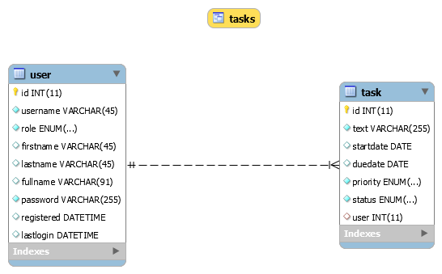
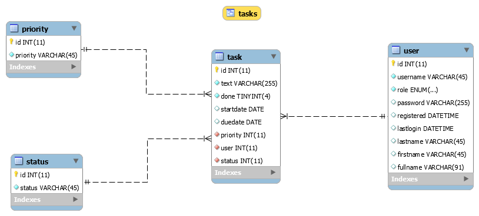
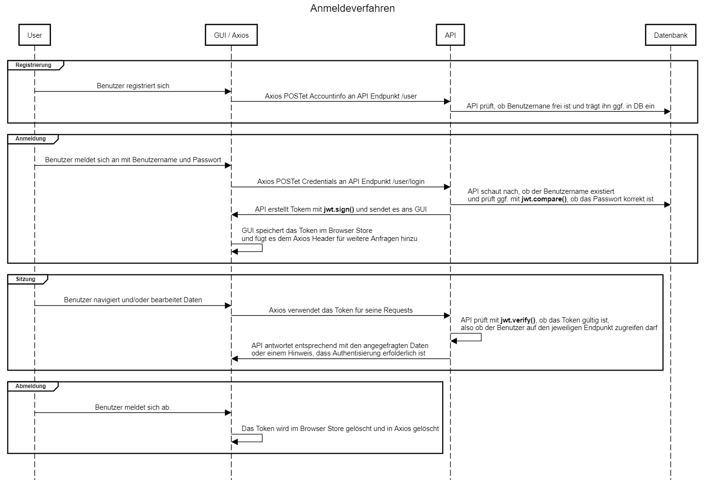

# Database Design
There are two supported data models both including the two base tables *user* and *task* and also a JOIN view. While the first design uses some ENUM colums for priority and status, the the second model one uses two additional lookup tables to achieve the same functionality.  
The according SQL DDL statements are provided for MySQL and PostgreSQL.
* [MySQL](designWithEnumDDL.sql)
* [PostgreSQL](designWithEnumPostgresDDL.sql)
* [MySQL with lookup tables](designWithTablesDDL.sql)

## Design with ENUM

## Design with Tables


# User Registration and Login Process

## Source Code of Diagram
Paste the code below into the left pane of [sequencediagram.org](https://sequencediagram.org) and see the diagram.

```js
title Anmeldeverfahren

participant User
participant "GUI / Axios" as GUI
participant API
participant "Datenbank" as DB
group Registrierung
User->GUI:Benutzer registriert sich
space -3
GUI->API:Axios POSTet Accountinfo an API Endpunkt /user
space -3
API->DB: API prüft, ob Benutzernane frei ist und trägt ihn ggf. in DB ein
end
group Anmeldung
User->GUI:Benutzer meldet sich an mit Benutzername und Passwort
GUI->API:Axios POSTet Credentials an API Endpunkt /user/login
space -3
API->DB: API schaut nach, ob der Benutzername existiert \nund prüft ggf. mit **jwt.compare()**, ob das Passwort korrekt ist
space -3
API->GUI: API erstellt Tokem mit **jwt.sign()** und sendet es ans GUI
GUI->GUI: GUI speichert das Token im Browser Store \nund fügt es dem Axios Header für weitere Anfragen hinzu
end

group Sitzung
User->GUI: Benutzer navigiert und/oder bearbeitet Daten
space -3
GUI->API: Axios verwendet das Token für seine Requests
space -3
API->API: API prüft mit **jwt.verify()**, ob das Token gültig ist, \nalso ob der Benutzer auf den jeweiligen Endpunkt zugreifen darf 
space -3
API->GUI: API antwortet entsprechend mit den angegefragten Daten \noder einem Hinweis, dass Authentisierung erfolderlich ist
end
group Abmeldung
User->GUI: Benutzer meldet sich ab.
GUI->GUI: Das Token wird im Browser Store gelöscht und in Axios gelöscht
end
```
